# CLIENTE FORMACIONES PLANESTIC-UD V2

## Descripción

Este proyecto tiene como objetivo la actualización del cliente para el aplicativo de formaciones de PlanEsTic-UD, con el fin de mejorar la experiencia del usuario. La actualización sigue un esquema previamente aprobado, orientado a optimizar la visualización y gestión de procesos, cohortes, módulos, asistencias y certificaciones, haciendo que la interfaz sea más intuitiva y fácil de manejar en comparación con la versión anterior.

Las principales funcionalidades incluyen:

- Creación y gestión de procesos
- Creación y gestión de cohortes
- Diseño de formularios personalizados para cada cohorte
- Configuración de módulos para eventos o diplomados
- Visualización de asistencias
- Gestión de certificaciones, que incluye:
  - Visualización de los cursantes certificados
    - Reenvío de certificados
    - Visualización de certificados
    - Descarga de certificados ya generados
  - Visualización de cursantes no certificados
    - Certificación individual de cursantes
    - Certificación masiva de cursantes seleccionados

## Tabla de Contenidos

1. [Descripción](#descripción)
2. [Tecnologías Utilizadas](#tecnologías-utilizadas)
3. [Instalación](#instalación)
4. [Uso](#uso)
5. [Vistas](#vistas)
6. [Documentación Técnica](#documentación-técnica)
7. [Estilo de Código](#estilo-de-código)
8. [Historial de Cambios](#historial-de-cambios)
9. [Contacto](#contacto)

---

## Tecnologías Utilizadas

- **HTML**: Estructura de la aplicación y organización de los elementos.
- **CSS**: Estilos y diseño visual.
- **JavaScript (Vanilla)**: Lógica de la aplicación, interacciones, manejo de eventos, conexión con API MID.

## Instalación

Pasos para clonar y ejecutar el proyecto en local:

1. Clonar el repositorio:  
   git clone https://github.com/udistrital/certificador_formaciones.git
2. Navegar a la carpeta del proyecto:  
   cd proyecto
3. Abrir el archivo index.html en un navegador web.

## Uso

1. Crear y gestionar procesos, cohortes y formularios.
2. Visualizar asistencias y certificaciones.
3. Gestionar certificados (generacion, descarga, reenvío, visualización).

## Vistas

1. Visual de todas las cohortes existentes de todas las formaciones:  
   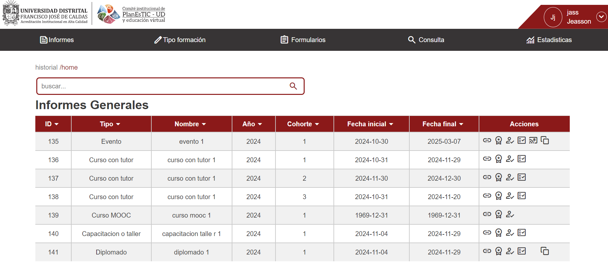
2. Visual procesos, (Curso con tutor)
   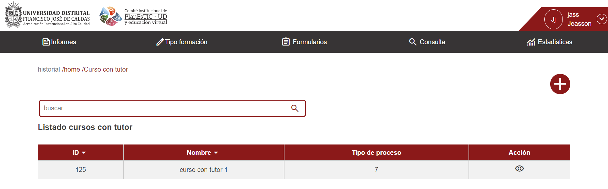  
   2.1 Creacion proceso  
   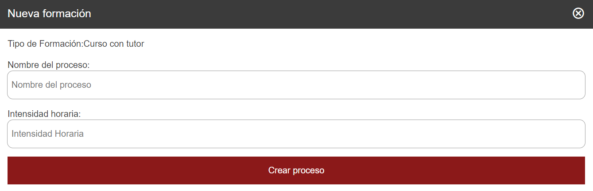
   2.2 Cohortes de proceso  
   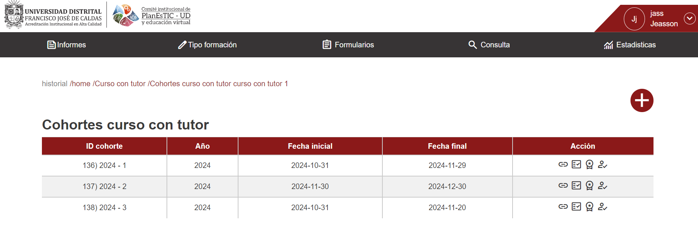
   2.3 Creacion de cohorte
   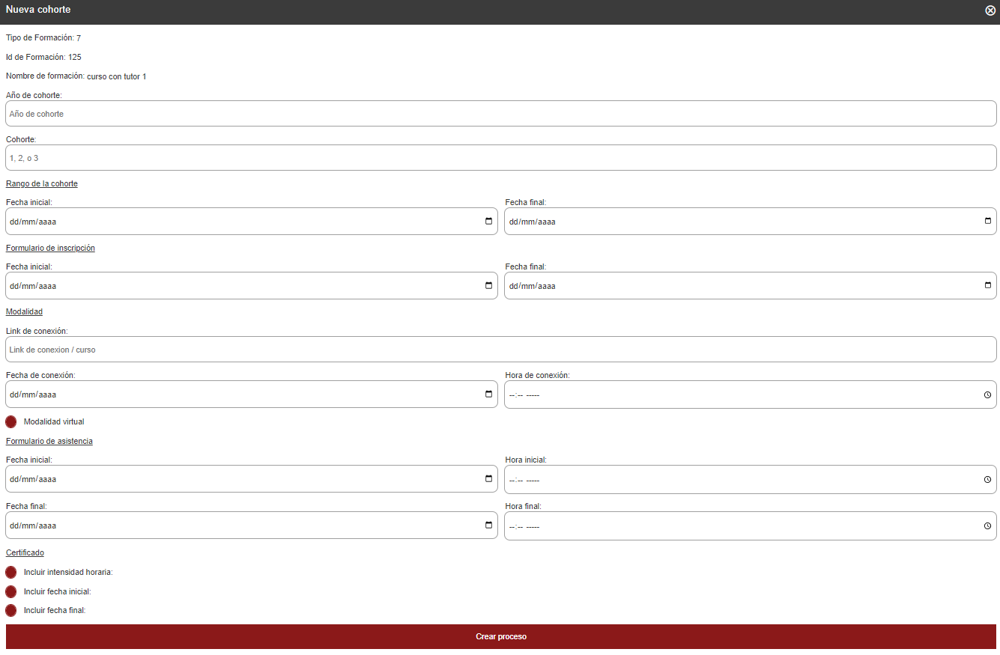
   2.4 Información cohorte
   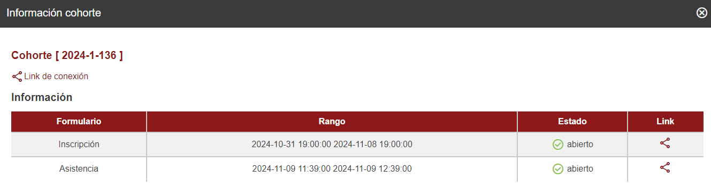
3. Visual asistencias a cohorte
   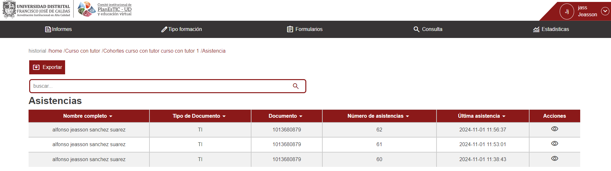
4. Certificados emitidos
   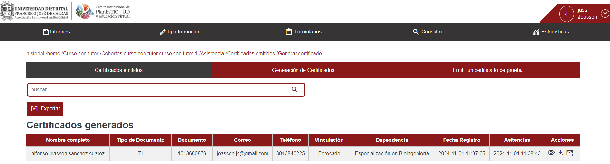
5. Generacion de certificados
   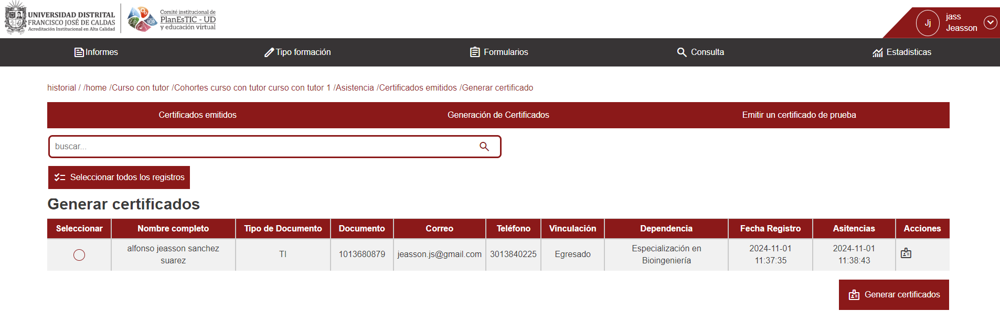
6. Visual de certificado de prueba
7. Visual cursantes registrados
   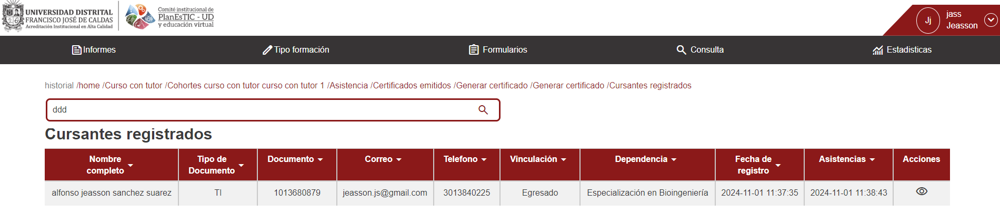
8. Visual ponentes registrados
   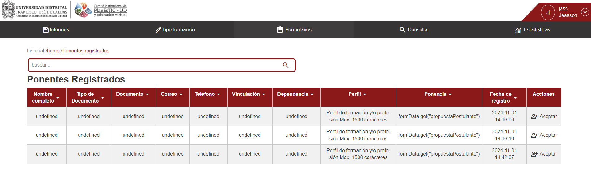
9. Visual modulos
   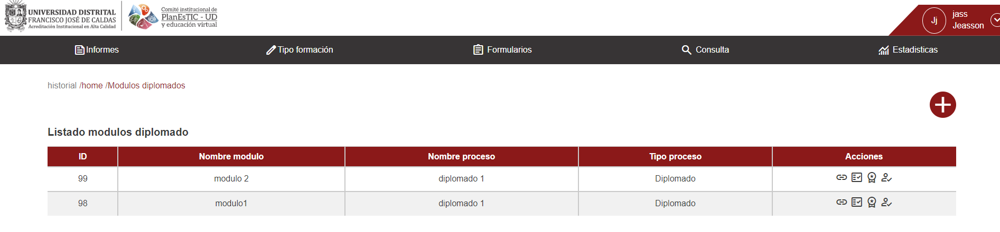

## Documentación Técnica

### Estructura del Proyecto

El proyecto está organizado en varios archivos y carpetas para facilitar el mantenimiento y la escalabilidad. A continuación, se presenta una descripción de cada uno de los principales componentes:

```plaintext
proyecto/
├── .vscode/                            # Configuración del entorno de Visual Studio Code
├── doc/                                # Documentación adicional del proyecto
├── images/                             # Recursos gráficos para la interfaz de usuario
│   ├── iconos/                         # Iconos utilizados en la aplicación
│   ├── Banner_formulario_Gris.jpg      # Imagen de banner gris para el formulario
│   ├── Banner_formulario_vinotinto.jpg # Imagen de banner color vinotinto para el formulario
│   ├── imgheader.png                   # Imagen del encabezado
│   ├── logopt.png                      # Logo principal
│   ├── logout.png                      # Icono de cerrar sesión
│   ├── UD-PlanEsTIC.png                # Logo de PlanEsTic en formato PNG
│   └── UD-PlanEsTIC.svg                # Logo de PlanEsTic en formato SVG
├── models/                             # Modelos o estructuras de datos
│   └── historialNav.js                 # Lógica de navegación histórica
├── pages/                              # Páginas de la aplicación
│   ├── AsistenciasPage.html            # Página de visualización de asistencias
│   ├── CursantesRegistrados.html       # Página de registro de cursantes
│   └── PonentesRegistrados.html        # Página de registro de ponentes
├── scripts/                            # Archivos JavaScript de la aplicación
│   ├── Fetching/                       # Funciones para manejar peticiones de datos
│   ├── funcionalidades/                # Módulos con funcionalidades específicas
│   ├── asistencias.js                  # Manejo de asistencias
│   ├── autorizacion.js                 # Lógica de autorización
│   ├── capacitacionTaller.js           # Funcionalidad para capacitaciones y talleres
│   ├── CerrarSesion.js                 # Lógica para cerrar sesión
│   ├── certificados.js                 # Manejo de certificados
│   ├── cohortesCurso.js                # Gestión de cohortes de cursos
│   ├── ...                             # (otros módulos específicos)
│   ├── header.js                       # Lógica del encabezado de la página
│   ├── modals.js                       # Funcionalidad para ventanas modales
│   ├── navegacion.js                   # Control de navegación
│   └── tablasContenidoInfGeneral.js    # Manejo de tablas de información general
├── styles/                             # Archivos de estilos
│   ├── index.css                       # Estilos principales de la aplicación
│   └── delete_data.js                  # Script para manejo de eliminación de datos
├── index.html                          # Archivo HTML principal de la interfaz de usuario
├── index.js                            # Archivo principal de JavaScript
├── LICENSE                             # Información de licencia del proyecto
├── LoginPage.html                      # Página de inicio de sesión
└── prettier.config.js                  # Configuración de Prettier para estilo de código
```

### Descripción de Carpetas Clave

- **images/**: Este directorio contiene las imágenes y otros recursos visuales utilizados en la aplicación, organizados para un fácil acceso y actualización.
- **models/**: Incluye modelos de datos y estructura de navegación.
- **pages/**: Contiene las páginas HTML principales de la aplicación.
- **scripts/**: Este archivo maneja la lógica principal de la aplicación. Aquí se encuentran las funciones que responden a las interacciones del usuario, como hacer clic en botones o completar formularios. Además, app.js incluye:

  - **Manejo de eventos**: Define y controla las acciones que se ejecutan al interactuar con elementos específicos de la interfaz.
  - **Validación de formularios**: Valida los datos ingresados por el usuario antes de enviarlos a la API.
  - **Llamadas a api.js**: Importa funciones desde api.js para comunicar la interfaz con el servidor y actualizar la información en tiempo real.

- **styles/**: Contiene los estilos CSS que definen la apariencia visual de la aplicación, incluyendo colores, tipografías, espaciados y el diseño de la interfaz. Separa el estilo de la lógica y estructura, facilitando modificaciones visuales sin alterar la funcionalidad.

### Estilo de Código

Para mantener la consistencia y facilitar la colaboración, seguimos las siguientes convenciones de estilo en el código:

- **Nombres de Variables**:

  - Usamos `camelCase` para nombres de variables propias del frontend.
  - Usamos `snake_case` para variables que representan campos en la API MID.

- **Indentación**:

  - La indentación es de **2 espacios** para todo el código, lo que asegura uniformidad en el formato.

- **Comentarios**:
  - Comentarios en línea se utilizan para explicar funciones clave y su propósito.
  - Los comentarios deben ser concisos y claros, proporcionando contexto sin obstruir la lectura del código.

### Ejemplo

```javascript
// Ejemplo de nombres de variables en camelCase para el frontend
let userName = "John Doe";
let isUserLoggedIn = true;

// Ejemplo de nombres en snake_case para variables de la API MID
let nombre_usuario = "Jane Doe";
let fecha_nacimiento = "1990-01-01";
```

## Historial de Cambios

### Noviembre 2024

- **Thu Nov 7 13:28:27 2024 -0500**: Inicio de documentación, cambios en README.
- **Tue Nov 5 14:34:26 2024 -0500**: Agregando hash a la información de las cohortes de las formaciones dentro de la vista; se agregan notificaciones de copia de enlaces en la información de las cohortes.
- **Tue Nov 5 12:09:59 2024 -0500**: Agregando hash a formularios de informes generales.
- **Fri Nov 1 15:30:21 2024 -0500**: Creación de capa que valida la disponibilidad del formulario para inscripciones de aspirantes.
- **Fri Nov 1 14:17:34 2024 -0500**: Corrección en el módulo de formulario de postulación a ponencias; ahora se llena a partir de un código de formulario.
- **Fri Nov 1 12:22:18 2024 -0500**: Corrección en el módulo de formulario de asistencia; validación de formulario, cursante, inscripción y llenado de formulario.

### Octubre 2024

- **Thu Oct 31 21:47:44 2024 -0500**: Se solucionaron errores al gestionar un formulario de registro de cursantes usando hash.
- **Thu Oct 31 17:24:26 2024 -0500**: Agregando código o hash para el llenado de formularios; pendientes los formularios de asistencia, postulación, documentación y evidencias.
- **Tue Oct 29 12:53:58 2024 -0500**: Prueba de funcionamiento y corrección de error al listar asistencias.
- **Mon Oct 28 11:44:21 2024 -0500**: Añadiendo fetching a certificaciones, solo `GET`, filtrando y configurando cursos MOOC.
- **Wed Oct 23 13:42:47 2024 -0500**: Modificación de ficheros de certificados; se agregan parámetros a las URLs para visualización de contenidos.
- **Wed Oct 2 21:37:33 2024 -0500**: Prueba de formularios de asistencias y registros en cursos tutor; solución de error en la notificación de inexistencia de registros.
- **Wed Oct 2 16:00:06 2024 -0500**: Cargue de notificación y corrección de errores en asistencias y registros.

### Septiembre 2024

- **Mon Sep 30 23:07:29 2024 -0500**: Creación de formularios, módulos, cohortes y visualización de información de cohorte.
- **Mon Sep 9 16:16:33 2024 -0500**: Agregando validación de existencia de cursante y registro de cohortes; solución de peticiones a informes generales y muestra de formularios existentes. Cambio de parámetro `virtual` a `sesion_virtual`.
- **Mon Aug 26 15:18:47 2024 -0500**: Cargue de información en formularios y captura para almacenamiento en el modelo de datos.
- **Sun Aug 25 21:05:04 2024 -0500**: Fetching y reutilización de código para páginas de formularios y formularios específicos.

### Agosto 2024

- **Fri Aug 23 12:35:39 2024 -0500**: Avance en la implementación de formularios; se implementan formularios de ponente, documentación y memorias para eventos.
- **Mon Aug 12 11:37:57 2024 -0500**: Corrección de redirección a páginas de formularios.
- **Tue Jul 30 15:00:06 2024 -0500**: Agregando fetching de informes generales.

### Julio 2024

- **Mon Jul 29 11:53:24 2024 -0500**: Agregando inserción y listado de módulos en eventos y diplomados.
- **Sun Jul 28 12:11:04 2024 -0500**: Mejora de código, escalabilidad y reutilización; fetching de cohortes e información en tutor, MOOC y talleres.
- **Fri Jul 26 16:10:27 2024 -0500**: Listado de cohortes en formaciones.
- **Fri Jul 26 13:04:24 2024 -0500**: Agregando creación de cohortes al API.
- **Wed Jul 24 11:05:52 2024 -0500**: Agregando escalabilidad y reutilización en cohortes de todas las formaciones.
- **Wed Jul 24 00:49:15 2024 -0500**: Escalabilidad y reutilización de código en cohortes de formaciones.
- **Tue Jul 23 22:48:06 2024 -0500**: Mejora de código; escalabilidad y reutilización.

### Junio 2024

- **Thu Jul 11 17:14:52 2024 -0500**: Fetch cursos con tutor.
- **Mon Jul 8 15:16:24 2024 -0500**: Accesibilidad verificada.
- **Mon Jul 8 15:01:22 2024 -0500**: ReCAPTCHA en login y corrección de estilos.
- **Mon Jul 8 13:34:57 2024 -0500**: Creación de formación curso con tutor.
- **Mon Jul 8 10:43:00 2024 -0500**: Autorización de páginas.
- **Mon Jun 24 14:17:48 2024 -0500**: Resolución de conflictos durante merge de `origin/master`.
- **Mon Jun 24 11:34:06 2024 -0500**: Modificación en labels de formularios para accesibilidad.

### Mayo 2024

- **Tue Jun 11 19:12:53 2024 -0500**: Cambios sugeridos por Johnny.
- **Wed Jun 5 15:56:28 2024 -0500**: Commit inicial.
- **Fri May 24 16:36:32 2024 -0500**: Mejorando y agregando nombre de formación en la navegación.
- **Fri May 24 15:00:41 2024 -0500**: Cambios por Johnny.

### Abril 2024

- **Mon May 20 12:18:29 2024 -0500**: Listado de formularios y redirección.
- **Fri May 17 14:00:36 2024 -0500**: Corrección de error en menú de navegación bajo el header.
- **Fri May 17 11:55:27 2024 -0500**: Agregando ícono en vistas.
- **Fri May 17 11:48:39 2024 -0500**: Corrección de estructura de carpetas y redireccionamiento.
- **Tue May 14 14:55:19 2024 -0500**: Reconfiguración de rutas de redirección en cohortes.
- **Tue May 14 14:07:18 2024 -0500**: Estructura del proyecto por carpetas.

### Enero 2024

- **Tue Dec 5 21:24:30 2023 -0500**: Finalización de wireframes en Vanilla JS.
- **Fri Dec 1 09:43:29 2023 -0500**: Corrección de rutas.
- **Fri Dec 1 09:27:16 2023 -0500**: Merge de branch 'main'.
- **Fri Dec 1 09:16:14 2023 -0500**: Primera entrega de avances.
- **Thu Nov 23 16:21:27 2023 -0500**: Inicio del proyecto de frontend para el certificador PLANESTIC, login y header.

## Contacto

**planesticud@udistrital.edu.co**
